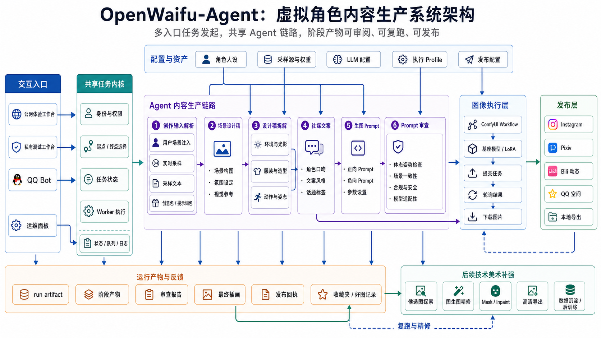
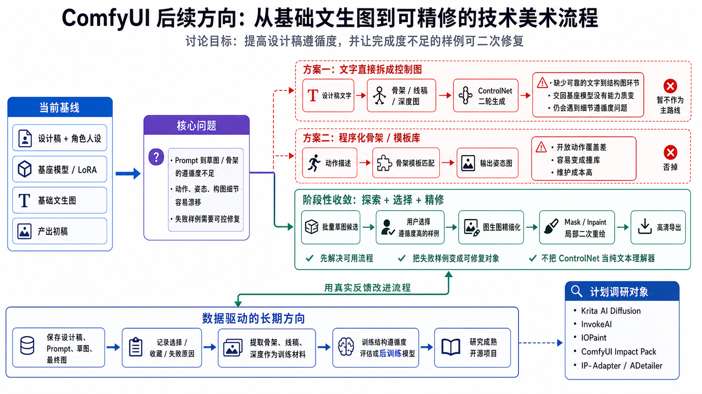

# openwaifu-agent

这个总仓库里，主产品在 [`openwaifu-agent/`](./openwaifu-agent/)。

## 项目架构

## ComfyUI 后续方向

主产品当前包含这些核心能力：

- QQ 生成链路与私聊服务
- 私有测试工作台
- 内容体验工作台
- 运维面板
- workbench 结果监听与 QQ 极简报告
- 图文发布能力

日常开发、调试、改产品逻辑，直接从 [`openwaifu-agent/README.md`](./openwaifu-agent/README.md) 进入。

[`domain-manage/`](./domain-manage/) 管理域名、Cloudflare、根域首页和内容体验工作台公网入口。首次把内容体验工作台接到公网，直接看 [`domain-manage/README.md`](./domain-manage/README.md) 里的 `bootstrap:workbench`。

根目录的 [`ai_must_read.txt`](./ai_must_read.txt) 是整个仓库的协作约束。
